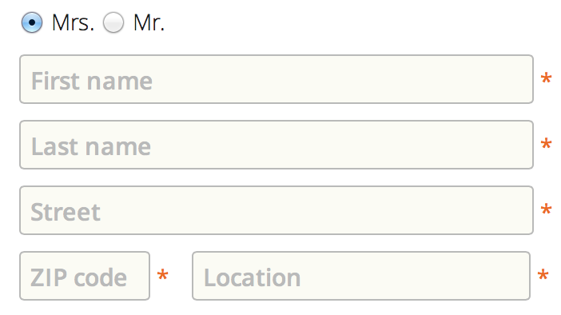
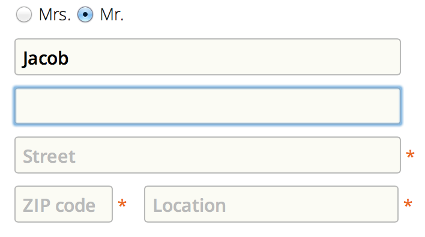

.. _auto_label: AutoLabelFormMixin

=====================================
Using auto-labeled forms in AngularJS
=====================================

If rendering space is sparse, sometimes it makes sense to place the label of an input field inside
itself, such as shown here:

these labels are rendered in grey, so that they can easily be distinguished from normal user input.
Now, if the user clicks into such a field (which then gains input focus), then the auto-label
vanishes. If the user did not enter any text into such a field when leaving (which then lost input
focus), then the auto-label reappears. Otherwise, the users typed in text remains in a dark
typeface.

To achieve this effect, include the **djangular** Javascript library into your project and add the
dependency to your AngularJS module:

.. code-block:: html

  
  ...
  

This directive checks for an attribute ``auto-label="any field label"`` in all input fields of type
text and type password of your DOM. If during Angular's compilation_ phase such a directive has
been found, then change the behavior of these input fields according to the description above.

The simplest way to add this feature for a form of your choice, is to use a **djangular** mixin
class::
 
  from django import forms
  from djangular.forms.auto_label import AutoLabelFormMixin
  
  class ContactForm(AutoLabelFormMixin, forms.Form):
      # all form fields as usual
      pass

you may of course add other mixins to this form class, such as
:ref:`NgModelFormMixin <angular-model-form>`.

.. note:: Remember to adopt your styles for these auto-labeled forms. To an empty input field, the
       class ``empty`` is added. So, when defining you styles, use a light grey or similar as
       text-color, to distinguish optically between labels and real input.

.. _compilation: http://docs.angularjs.org/api/ng.$compile
